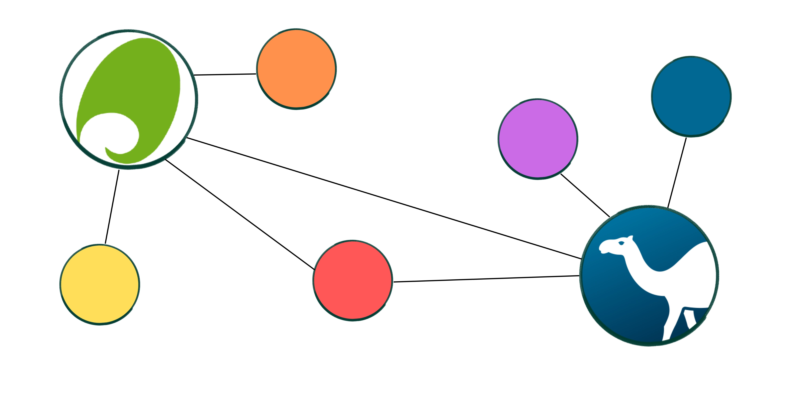
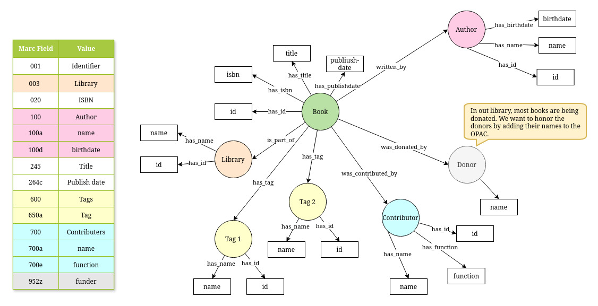

# MarcXML2RDF4Koha

 

This is a small university project @ TH Wildau, Germany.

Idea: Parse our MarcXML data to RDF (Turtle) and save the triplets in a apache jena fuseki database. Then visualize the data as a knowledge graph.

STATUS:
- [X] Get MarcXML Data
- [X] Set up apache Jena Fuseki as docker container
- [X] [Define a Data Model](#data-model)
- [X] Write first script for the parser
- [X] Write first script for the database integration
- [X] Write first script for the visualization
- [ ] Back to the beginning: Evaluate all steps again
  - [ ] Evaluate data model
  - [ ] Evaluate parsing module
  - [ ] Evaluate database integration
    - [ ] I have the feeling I should spend more time here... 
  - [ ] Evaluate visualization
- [ ] Write better documentation
- [ ] Write a query script for the UI
- [ ] Evaluate the query script for the UI
- [X] Self host Koha
- [ ] Do research on Koha plugin integration

Future:
- [ ] Seperate the xml2rdf package from the project (Because this could be a small project by its own)
- [ ] How about some images or nice elements in the visualization?

My goal: At the end I want this to be a koha plugin, for easy conversion of MarcXML to Turtle format and having a native integration for the OPAC.

PS: Somehow I have the urge to document all of my work here, becuase I've never wrote a perl script before, neither a plugin for koha... Stay tuned!

Feel free to commit :)

---

## Data Model

